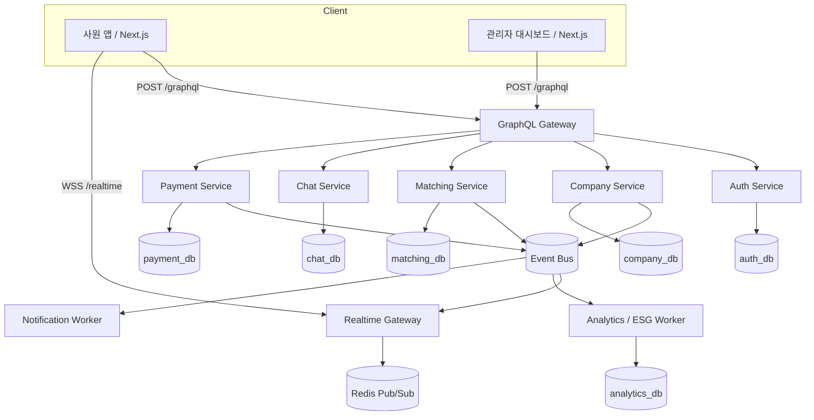

# Ridy — 시스템 아키텍처

> **기업 단위 폐쇄형 카풀 서비스**
> 같은 회사 사원끼리만 카풀할 수 있는 폐쇄형 플랫폼. 초대 코드 기반 가입으로 기업 경계를 보장하고, 관리자 대시보드를 통해 이용 통계·ESG 리포트를 제공한다.

---

## 전체 구성도

Ridy의 외부 API 진입점은 **GraphQL Gateway**다. GraphQL은 클라이언트용 API 조합 계층으로 사용하고, 내부 서비스 간 통신은 gRPC/internal HTTP와 이벤트 메시지를 사용한다. 세부 MSA 경계는 [MSA.md](./MSA.md)를 기준으로 한다.



> MVP에서는 단일 NestJS 애플리케이션 안에 위 서비스를 모듈로 구현할 수 있다. 단, 모듈 경계와 GraphQL schema, 이벤트 이름, 데이터 소유권은 MSA 전환을 전제로 설계한다.

---

## 핵심 도메인 개념

### Company (회사)

폐쇄형 카풀의 기본 단위. 모든 사원과 카풀은 회사에 귀속된다.

| 속성 | 설명 |
|---|---|
| `id` | 고유 식별자 |
| `name` | 회사명 |
| `inviteCode` | 사원 가입용 초대 코드 (고유, 변경 가능) |
| `adminId` | 관리자 User ID |
| `maxMembers` | 최대 사원 수 |
| `address` | 회사 주소 (카풀 도착지 기본값) |
| `createdAt` | 생성 일시 |

### 초대 코드 흐름

```
┌────────────┐    발급     ┌──────────────┐    공유     ┌────────────┐
│  관리자     │───────────▶│  inviteCode  │───────────▶│  신규 사원  │
│  대시보드   │            │  (예: RIDY-A7K)│           │            │
└────────────┘            └──────────────┘            └─────┬──────┘
                                                       │
                                                       ▼ 가입 시 입력
                                              ┌──────────────────┐
                                              │  user.companyId  │
                                              │  = company.id    │
                                              │  자동 매핑       │
                                              └──────────────────┘
```

- 관리자가 대시보드에서 초대 코드를 생성·재발급한다.
- 신규 사원은 회원가입 시 초대 코드를 입력해야 하며, 유효한 코드일 경우 해당 `company`에 자동으로 매핑된다.
- 초대 코드가 없으면 가입할 수 없다 (폐쇄성 보장).

### 매칭 제약 (회사 경계)

```
  Company A 사원         Company B 사원
  ┌───────────┐         ┌───────────┐
  │  김철수    │         │  이영희    │
  │  박민수    │  ✕ 매칭  │  최지현    │
  │  정다은    │ 불가능!  │  한승우    │
  └─────┬─────┘         └───────────┘
        │
        ▼ 같은 회사끼리만 매칭
  ┌───────────┐
  │ 김철수 ↔ 박민수 │  ✓ 매칭 가능
  │ 김철수 ↔ 정다은 │  ✓ 매칭 가능
  └───────────┘
```

- 매칭 서비스는 항상 `WHERE companyId = :currentUser.companyId` 조건으로 검색한다.
- 다른 회사 사원은 검색 결과에 노출되지 않는다.
- 카풀 방(Ride)도 회사에 귀속되어, 크로스 컴퍼니 접근이 원천 차단된다.

---

## 기술 스택

### 프론트엔드

| 기술 | 용도 |
|---|---|
| Next.js 16 (App Router) | 웹 서비스 (사원 앱 + 관리자 대시보드) |
| shadcn/ui | UI 컴포넌트 라이브러리 |
| TypeScript | 타입 안전성 |
| Tailwind CSS | 스타일링 |
| TanStack Query | 서버 상태 관리 |
| Socket.IO Client | 실시간 채팅 |
| Recharts | 관리자 대시보드 차트 |

### 백엔드

| 기술 | 용도 |
|---|---|
| NestJS 11 | GraphQL Gateway 및 bounded context 서비스 구현 |
| GraphQL (schema-first) | 외부 클라이언트 API 계약 / Gateway schema |
| Apollo Server | GraphQL 실행 계층 |
| TypeScript | 타입 안전성 |
| Prisma 7 | 서비스별 데이터 접근 계층 |
| PostgreSQL | 서비스별 논리 DB 또는 schema |
| Redis | 캐시, 세션 보조 저장소, Pub/Sub |
| Socket.IO | Realtime Gateway / WebSocket 실시간 채팅 |
| BullMQ | 작업 큐 (알림, 정산, ESG 집계) |
| Event Bus | 서비스 간 비동기 이벤트 전달 |

### 인프라

| 기술 | 용도 |
|---|---|
| AWS ECS (Fargate) | 컨테이너 오케스트레이션 |
| AWS RDS (PostgreSQL) | 관리형 DB |
| AWS ElastiCache (Redis) | 관리형 Redis |
| AWS S3 / CloudFront | 정적 자산 CDN |
| AWS SES | 이메일 발송 |
| GitHub Actions | CI/CD |

### 외부 서비스

| 서비스 | 용도 |
|---|---|
| 카카오/구글/Apple | 소셜 로그인 |
| 토스페이먼츠 | 결제 |
| AWS SNS | 푸시 알림 |
| Google Maps / Mapbox | 지도, 경로 |
| CoolSMS | 문자 인증 |

---

## 마이크로서비스 경계

상세 기준은 [MSA.md](./MSA.md)를 따른다.

| 서비스 | 책임 | 소유 데이터 | 공개 계약 |
|---|---|---|---|
| **GraphQL Gateway** | 외부 GraphQL schema, 인증 컨텍스트, 회사 스코프, 화면 데이터 조합 | 없음 | `POST /graphql` |
| **Auth Service** | 소셜 로그인, JWT, 세션, 권한 판단 | `users`, `sessions`, `oauth_accounts` | Auth query/command |
| **Company Service** | 회사, 초대 코드, 사원 목록, 관리자 통계 | `companies`, `invite_codes`, `member_snapshots` | Company query/command, events |
| **Matching Service** | 카풀 등록, 회사 내 검색, 매칭 요청/수락 | `rides`, `ride_requests`, `vehicles`, `reviews` | Matching query/command, events |
| **Chat Service** | 채팅방, 메시지 이력, 읽음 상태 | `chat_rooms`, `messages`, `read_receipts` | Chat query, realtime events |
| **Payment Service** | 요금 계산, 정산, 결제 | `settlements`, `payments`, `payment_methods` | Payment query/command, events |
| **Analytics Worker** | 이용 통계, ESG 리포트 집계 | `usage_stats`, `esg_reports` | Analytics query, event consumer |
| **Notification Worker** | 푸시/이메일/SMS 알림 | `notification_logs` | event consumer |

> MVP에서는 모듈형 모놀리스로 시작할 수 있지만, 다른 서비스의 DB를 직접 조회하지 않는다는 소유권 규칙은 처음부터 지킨다.

---

## 데이터 모델 (Prisma Schema 핵심)

```prisma
model Company {
  id          String    @id @default(cuid())
  name        String
  inviteCode  String    @unique
  address     String?
  maxMembers  Int       @default(500)
  adminId     String
  admin       User      @relation("CompanyAdmin", fields: [adminId], references: [id])
  members     User[]
  rides       Ride[]
  inviteCodes InviteCode[]
  esgReports  EsgReport[]
  createdAt   DateTime  @default(now())
  updatedAt   DateTime  @updatedAt
}

model User {
  id          String    @id @default(cuid())
  email       String    @unique
  name        String
  phone       String?
  companyId   String
  company     Company   @relation(fields: [companyId], references: [id])
  role        UserRole  @default(MEMBER)   // ADMIN | MEMBER
  rides       Ride[]
  sessions    Session[]
  createdAt   DateTime  @default(now())
}

model InviteCode {
  id          String    @id @default(cuid())
  code        String    @unique
  companyId   String
  company     Company   @relation(fields: [companyId], references: [id])
  usedBy      String?   // 사용한 유저 ID
  usedAt      DateTime?
  expiresAt   DateTime?
  isActive    Boolean   @default(true)
  createdAt   DateTime  @default(now())
}

model Ride {
  id          String    @id @default(cuid())
  driverId    String
  driver      User      @relation(fields: [driverId], references: [id])
  companyId   String
  company     Company   @relation(fields: [companyId], references: [id])
  departure   String
  destination String
  departureTime DateTime
  availableSeats Int
  status      RideStatus @default(OPEN)
  matchings   Matching[]
  createdAt   DateTime  @default(now())
}

model EsgReport {
  id          String    @id @default(cuid())
  companyId   String
  company     Company   @relation(fields: [companyId], references: [id])
  period      String          // "2026-Q1", "2026-06" 등
  totalRides  Int
  totalDistanceKm  Float
  co2SavedKg  Float
  participantCount Int
  createdAt   DateTime  @default(now())
}

enum UserRole {
  ADMIN
  MEMBER
}

enum RideStatus {
  OPEN
  MATCHED
  IN_PROGRESS
  COMPLETED
  CANCELLED
}
```

---

## 관리자 대시보드

관리자(`UserRole.ADMIN`)만 접근 가능한 전용 화면. `/admin` 경로에 위치한다.

### 기능 구성

| 기능 | 설명 |
|---|---|
| **초대 코드 관리** | 신규 코드 생성, 기존 코드 폐기/재발급, 사용 이력 조회 |
| **사원 관리** | 가입 사원 목록, 활성/비활성 상태, 강제 탈퇴 |
| **이용 통계** | 일/주/월 단위 카풀 이용 건수, 참여율, 노선 히트맵 |
| **ESG 리포트** | 탄소 절감량(CO₂), 총 주행 거리 절감, 참여 인원 추이 — 분기 리포트 다운로드 |
| **공지사항** | 사원 대상 공지 발송 (앱 내 알림) |

### ESG 리포트 산출 로직

```
CO₂ 절감량 = 매칭 건수 × 평균 출퇴근 거리(km) × 차량 평균 배출계수(0.21 kg CO₂/km)
```

- Bull 크론잡이 매일 새벽 전일 데이터를 집계하여 `EsgReport`에 upsert.
- 관리자는 대시보드에서 월/분기 단위로 리포트를 조회 및 PDF 다운로드.

### 개인 친환경 임팩트 조회

사원 앱의 친환경 임팩트 대시보드는 관리자용 `companyEsgReport`와 분리된 사용자 범위 GraphQL API를 사용한다.

| Query | 대상 | 범위 | 설명 |
|---|---|---|---|
| `myCarbonImpact(period: String)` | 사원 | `viewer.id` + `viewer.companyId` | 기간 내 개인 누적 CO₂ 절감량, 트리 환산, 레벨, 뱃지 |
| `carbonHistory(period: String!, pagination: PaginationInput)` | 사원 | `viewer.id` + `viewer.companyId` | 월별 절감 추이와 운행별 절감 내역 |
| `companyEsgReport(period: String!)` | 관리자 | `viewer.companyId` | 회사 단위 ESG 리포트 |

개인 임팩트 산출 기준:

1. `COMPLETED` 상태의 카풀 중 현재 사용자가 운전자이거나 승인된 탑승자인 운행만 포함한다.
2. 운행은 반드시 `viewer.companyId`로 필터링한다. 클라이언트에서 `companyId`를 전달하지 않는다.
3. 기본 CO₂ 절감량은 `운행 거리(km) × 차량 평균 배출계수(0.21 kg CO₂/km)`로 계산한다.
4. `treeEquivalent`는 `co2SavedKg / 22`로 계산한다. 22kg은 나무 1그루의 연간 CO₂ 흡수량 추정치이다.
5. 레벨과 뱃지는 서버가 동일 기준으로 계산해 반환한다. 프론트엔드는 표시만 담당한다.
6. MVP에서는 개인 임팩트 데이터를 `Ride`, `RideRequest`, `User`에서 읽어 계산한다. `EsgReport`는 회사/관리자 집계용으로 유지하며, 개인 임팩트를 위해 신규 테이블을 추가하지 않는다.

레벨 기준:

| 레벨 | 조건 |
|---|---|
| `SEED` | 0kg 이상 |
| `SPROUT` | 10kg 이상 |
| `TREE` | 50kg 이상 |
| `FOREST` | 100kg 이상 |

기본 뱃지 기준:

| 뱃지 ID | 조건 |
|---|---|
| `FIRST_SHARE` | 완료된 카풀 1회 이상 |
| `TEN_KG_SAVER` | CO₂ 10kg 이상 절감 |
| `MONTHLY_STREAK` | 같은 달 완료 카풀 4회 이상 |

---

## API 설계 (GraphQL 핵심 스키마)

```graphql
# ── Company ──────────────────────────────────────
type Company {
  id: ID!
  name: String!
  inviteCode: String!
  address: String
  maxMembers: Int!
  memberCount: Int!
  admin: User!
  members(offset: Int, limit: Int): [User!]!
}

# ── Invite Code ──────────────────────────────────
type InviteCode {
  id: ID!
  code: String!
  isActive: Boolean!
  usedBy: User
  usedAt: DateTime
  expiresAt: DateTime
  createdAt: DateTime!
}

# ── ESG Report ───────────────────────────────────
type EsgReport {
  id: ID!
  period: String!
  totalRides: Int!
  totalDistanceKm: Float!
  co2SavedKg: Float!
  participantCount: Int!
}

type CarbonImpact {
  period: String!
  totalRides: Int!
  totalDistanceKm: Float!
  co2SavedKg: Float!
  treeEquivalent: Float!
  level: String!
  badges: [CarbonBadge!]!
}

type CarbonBadge {
  id: ID!
  label: String!
  description: String!
  achievedAt: DateTime
}

type CarbonHistoryPoint {
  period: String!
  totalRides: Int!
  totalDistanceKm: Float!
  co2SavedKg: Float!
}

type CarbonRideSaving {
  rideId: ID!
  completedAt: DateTime!
  departureAddr: String
  arrivalAddr: String
  distanceKm: Float!
  co2SavedKg: Float!
}

type CarbonHistory {
  monthly: [CarbonHistoryPoint!]!
  rides: [CarbonRideSaving!]!
  pageInfo: PageInfo!
}

# ── Queries ──────────────────────────────────────
type Query {
  # 사원
  myCompany: Company!
  searchRides(departure: LatLng!, destination: LatLng!, time: DateTime!): [Ride!]!
    @auth @companyScope

  # 관리자 전용
  companyInviteCodes: [InviteCode!]!  @auth @adminOnly
  companyMembers(offset: Int!, limit: Int!): MemberList!  @auth @adminOnly
  companyStats(period: StatPeriod!): UsageStat!  @auth @adminOnly
  companyEsgReport(period: String!): EsgReport!  @auth @adminOnly
  myCarbonImpact(period: String): CarbonImpact!  @auth @companyScope
  carbonHistory(period: String!, pagination: PaginationInput): CarbonHistory!  @auth @companyScope
}

# ── Mutations ────────────────────────────────────
type Mutation {
  # 가입 (초대 코드 필수)
  signUp(input: SignUpInput!): AuthPayload!
  # 관리자 전용
  createInviteCode: InviteCode!  @auth @adminOnly
  revokeInviteCode(codeId: ID!): Boolean!  @auth @adminOnly
  deactivateMember(userId: ID!): Boolean!  @auth @adminOnly
  regenerateInviteCode: String!  @auth @adminOnly
}

# ── Directives ───────────────────────────────────
# @auth         — 로그인 필요
# @adminOnly    — UserRole.ADMIN 전용
# @companyScope — 현재 유저의 companyId로 자동 필터링
```

---

## 인증·가입 흐름

```
1. 소셜 로그인 (카카오/구글/Apple) → OAuth 토큰 획득
2. 최초 가입자 → 초대 코드 입력 화면
3. 초대 코드 검증:
   - 존재 여부 → InviteCode.isActive && !usedAt
   - 만료 여부 → expiresAt 확인
   - 회원 수 초과 → Company.maxMembers 확인
4. 검증 통과 → User 생성 (companyId = inviteCode.companyId)
5. InviteCode.usedBy, usedAt 업데이트
6. JWT 발급 → 클라이언트 저장
```

> 이미 가입된 유저는 소셜 로그인만으로 바로 JWT 발급.

---

## 보안 설계 (폐쇄성 보장)

| 계층 | 조치 |
|---|---|
| **가입** | 초대 코드 없으면 가입 불가 |
| **인가** | 모든 쿼리/뮤테이션에 `@auth` + `@companyScope` 적용 |
| **매칭** | `searchRides` 결과가 항상 `companyId`로 필터링됨 |
| **채팅** | 방(Room) 참여 시 `companyId` 일치 확인 |
| **관리자** | `@adminOnly` 디렉티브로 관리자 권한 검증 |
| **GraphQL Gateway** | JWT 검증, query complexity 제한, rate limit, persisted query 적용 |
| **초대 코드** | 단일 사용(1회용) 또는 다중 사용(기간 만료) 설정 가능 |

---

## 실시간 아키텍처

```
┌──────────────┐         ┌──────────────────────┐
│  사원 클라이언트│◀─WSS──▶│  Socket.IO Gateway   │
│  (채팅,       │         │  (NestJS Gateway)    │
│   라이드 갱신) │         └──────────┬───────────┘
└──────────────┘                    │
                          ┌─────────▼─────────┐
                          │  Redis Pub/Sub     │
                          │  채널: company:{id} │
                          └───────────────────┘
```

- 모든 실시간 이벤트는 `company:{companyId}` 네임스페이스로 격리.
- 다른 회사의 소켓 이벤트는 수신되지 않음.
- 라이드 상태 변경, 새 메시지, 매칭 알림이 해당 채널로 브로드캐스트.

---

## 배포 아키텍처

```
                    ┌──────────────────┐
                    │  CloudFront CDN  │
                    └────────┬─────────┘
                             │
              ┌──────────────▼──────────────┐
              │      ALB (Load Balancer)    │
              └──┬──────────────────────┬───┘
                 │                      │
          ┌──────▼──────┐        ┌──────▼──────┐
          │  ECS Fargate│        │  ECS Fargate│
          │  (NestJS    │        │  (Next.js   │
          │   API)      │        │   Web)      │
          └──────┬──────┘        └─────────────┘
                 │
     ┌───────────┼───────────┐
     │           │           │
┌────▼────┐ ┌────▼────┐ ┌────▼────┐
│  RDS    │ │ Elasti  │ │  S3     │
│  (PG)   │ │ Cache   │ │  (R2)   │
└─────────┘ └─────────┘ └─────────┘
```

---

## 마이그레이션 노트 (오픈 → 기업 폐쇄형)

| 항목 | 변경 전 (오픈 카풀) | 변경 후 (기업 폐쇄형) |
|---|---|---|
| 가입 | 소셜 로그인 즉시 가입 | 소셜 로그인 + **초대 코드 필수** |
| 유저 모델 | `User` 독립 | `User.companyId` 필수 (FK → Company) |
| 매칭 검색 | 전체 유저 대상 | **같은 companyId 유저만** |
| 관리 기능 | 없음 | **관리자 대시보드** (초대 코드, 사원, 통계, ESG) |
| 채팅 | 전체 오픈 | **회사 네임스페이스 격리** |
| 리포트 | 없음 | **ESG 리포트** (탄소 절감, 이용 통계) |
| 프론트엔드 | 사원 앱 단일 | **사원 앱 + 관리자 대시보드** (분리 라우트) |
