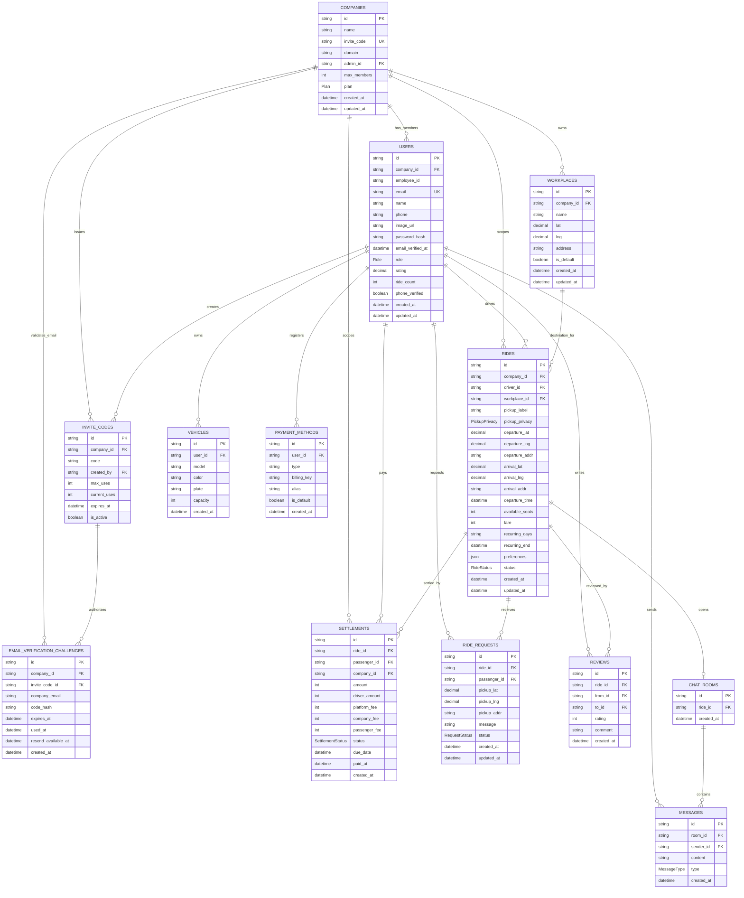

# Ridy — 데이터베이스 스키마 (회사 이메일 인증 기반 동네→직장 카풀 서비스)

> Ridy는 회사 이메일 도메인 기반 폐쇄형 카풀 서비스입니다. 모든 유저는 반드시 가입 코드와 회사 이메일 인증코드 검증을 거쳐 소속 회사(Company)에 매핑되어야 하며,
> 카풀 매칭은 **같은 회사 이메일 도메인(company_id/domain)에 소속된 구성원 간에만** 이루어지며, MVP 매칭 방향은 **동네 출발지 → 회사 근무지**로 제한됩니다.

---

## ERD



> 매칭/요청/정산/채팅은 같은 `company_id` 경계 안에서만 허용한다. 가입 시 `Company.domain`, `InviteCode`, `EmailVerificationChallenge` 검증이 모두 성공해야 `User.company_id`가 확정된다.

---

## Prisma 스키마

```prisma
// ============================================================
// 회사 (Company) — 폐쇄형 카풀의 최상위 격리 단위
// ============================================================
model Company {
  id          String   @id @default(uuid())
  name        String   @db.VarChar(100)                    // 회사명
  inviteCode  String   @unique @map("invite_code") @db.VarChar(20) // 회사 고유 가입 코드
  domain      String   @db.VarChar(100)                    // 회사 이메일 도메인 (검증용, 예: "acme.co.kr")
  adminId     String   @unique @map("admin_id")             // 최초 도메인 운영자 user.id
  maxMembers  Int      @default(50) @map("max_members")    // 최대 구성원 수
  plan        Plan     @default(FREE)                      // 후속 B2B 확장 예약 필드. MVP 수수료/기능 분기에는 사용하지 않음

  createdAt   DateTime @default(now()) @map("created_at")
  updatedAt   DateTime @updatedAt      @map("updated_at")

  // Relations
  admin       User        @relation("CompanyAdmin", fields: [adminId], references: [id])
  users       User[]
  inviteCodes InviteCode[]
  emailVerificationChallenges EmailVerificationChallenge[]
  rides       Ride[]
  settlements Settlement[]
  workplaces  Workplace[]

  @@index([domain])
  @@map("companies")
}

// ============================================================
// 회사 근무지 (Workplace) — 동네→직장 카풀의 목적지
// ============================================================
model Workplace {
  id        String   @id @default(uuid())
  companyId String   @map("company_id")
  name      String   @db.VarChar(100)
  lat       Decimal  @db.Decimal(10, 7)
  lng       Decimal  @db.Decimal(10, 7)
  address   String   @db.VarChar(255)
  isDefault Boolean  @default(false) @map("is_default")

  createdAt DateTime @default(now()) @map("created_at")
  updatedAt DateTime @updatedAt      @map("updated_at")

  company   Company  @relation(fields: [companyId], references: [id])
  rides     Ride[]

  @@index([companyId, isDefault])
  @@map("workplaces")
}

enum Plan {
  // 후속 B2B 확장 예약. MVP에서는 FREE/PRO/ENTERPRISE 분기를 구현하지 않는다.
  FREE
  PRO
  ENTERPRISE
}

// ============================================================
// 가입 코드 (InviteCode) — 도메인 운영자가 생성, 신규 구성원 가입용
// ============================================================
model InviteCode {
  id          String    @id @default(uuid())
  companyId   String    @map("company_id")
  code        String    @db.VarChar(6)                      // 6자리 영숫자
  createdBy   String    @map("created_by")
  maxUses     Int       @default(10) @map("max_uses")       // 최대 사용 횟수
  currentUses Int       @default(0) @map("current_uses")    // 현재 사용 횟수
  expiresAt   DateTime? @map("expires_at")                  // 만료일 (null=무제한)
  isActive    Boolean   @default(true) @map("is_active")

  // Relations
  company     Company   @relation(fields: [companyId], references: [id])
  creator     User      @relation("InviteCodeCreator", fields: [createdBy], references: [id])
  emailVerificationChallenges EmailVerificationChallenge[]

  @@unique([companyId, code])
  @@index([createdBy])
  @@index([companyId, isActive, expiresAt])
  @@map("invite_codes")
}

// ============================================================
// 사용자 (User) — 반드시 하나의 회사/이메일 도메인에 소속
// ============================================================
model User {
  id            String   @id @default(uuid())
  companyId     String   @map("company_id")                 // 필수: 소속 회사/도메인
  employeeId    String?  @map("employee_id") @db.VarChar(50) // 선택: 사번
  email         String   @unique @db.VarChar(255)
  name          String   @db.VarChar(100)
  phone         String?  @db.VarChar(20)
  imageUrl      String?  @map("image_url") @db.Text
  passwordHash  String   @map("password_hash") @db.VarChar(255) // 필수: 비밀번호 해시. 원문 저장 금지
  emailVerifiedAt DateTime? @map("email_verified_at")            // 회사 이메일 인증 완료 시각
  role          Role     @default(PASSENGER)
  rating        Decimal  @default(0.0) @db.Decimal(2, 1)
  rideCount     Int      @default(0) @map("ride_count")
  phoneVerified Boolean  @default(false) @map("phone_verified")

  createdAt     DateTime @default(now()) @map("created_at")
  updatedAt     DateTime @updatedAt      @map("updated_at")

  // Relations
  company       Company        @relation(fields: [companyId], references: [id])
  vehicles      Vehicle[]
  ridesAsDriver Ride[]         @relation("RideDriver")
  rideRequests  RideRequest[]
  reviewsGiven  Review[]       @relation("ReviewFrom")
  reviewsRecv   Review[]       @relation("ReviewTo")
  payments      PaymentMethod[]
  settlements   Settlement[]
  createdInviteCodes InviteCode[] @relation("InviteCodeCreator")
  adminOf       Company?       @relation("CompanyAdmin", fields: [id], references: [adminId])

  @@unique([companyId, employeeId]) // 같은 회사 내 사번 중복 방지
  @@index([companyId])
  @@index([companyId, emailVerifiedAt])
  @@index([companyId, role])
  @@map("users")
}

// ============================================================
// 회사 이메일 인증 요청 — 가입 전 인증코드 challenge
// ============================================================
model EmailVerificationChallenge {
  id                 String    @id @default(uuid())
  companyId          String    @map("company_id")
  inviteCodeId       String    @map("invite_code_id")
  companyEmail       String    @map("company_email") @db.VarChar(255)
  codeHash           String    @map("code_hash") @db.VarChar(255) // 6자리 코드의 해시. 원문 저장 금지
  expiresAt          DateTime  @map("expires_at")
  usedAt             DateTime? @map("used_at")
  resendAvailableAt  DateTime  @map("resend_available_at")

  createdAt          DateTime  @default(now()) @map("created_at")

  company            Company   @relation(fields: [companyId], references: [id])
  inviteCode         InviteCode @relation(fields: [inviteCodeId], references: [id])

  @@index([companyEmail, expiresAt])
  @@index([companyId, companyEmail, usedAt])
  @@map("email_verification_challenges")
}

enum Role {
  PASSENGER
  DRIVER
  BOTH
  ADMIN   // 도메인 운영자 / 후속 기업 관리자
}

// ============================================================
// 차량 (Vehicle)
// ============================================================
model Vehicle {
  id        String   @id @default(uuid())
  userId    String   @map("user_id")
  model     String   @db.VarChar(100)
  color     String?  @db.VarChar(50)
  plate     String   @db.VarChar(20)
  capacity  Int      @default(4)

  createdAt DateTime @default(now()) @map("created_at")

  user      User     @relation(fields: [userId], references: [id])

  @@unique([userId, plate])
  @@index([userId])
  @@map("vehicles")
}

// ============================================================
// 카풀 운행 (Ride) — 같은 기업 내에서만 생성/매칭
// ============================================================
model Ride {
  id              String       @id @default(uuid())
  companyId       String       @map("company_id")              // ★ 소속 기업 (격리 키)
  driverId        String       @map("driver_id")
  workplaceId     String       @map("workplace_id")
  pickupLabel     String       @map("pickup_label") @db.VarChar(100) // 예: 성수동 인근, 왕십리역 도보 5분
  pickupPrivacy   PickupPrivacy @default(APPROXIMATE) @map("pickup_privacy")
  departureLat    Decimal      @map("departure_lat") @db.Decimal(10, 7)
  departureLng    Decimal      @map("departure_lng") @db.Decimal(10, 7)
  departureAddr   String?      @map("departure_addr") @db.VarChar(255)
  arrivalLat      Decimal      @map("arrival_lat") @db.Decimal(10, 7)
  arrivalLng      Decimal      @map("arrival_lng") @db.Decimal(10, 7)
  arrivalAddr     String?      @map("arrival_addr") @db.VarChar(255)
  departureTime   DateTime     @map("departure_time")
  availableSeats  Int          @map("available_seats")
  fare            Int?                                               // 1인 요금 (원)
  recurringDays   String?      @map("recurring_days") @db.VarChar(50)  // MON,TUE,...
  recurringEnd    DateTime?    @map("recurring_end")                     // 정기 카풀 종료일
  preferences     Json?                                             // smoking, pet, luggage 등
  status          RideStatus   @default(OPEN)

  createdAt       DateTime     @default(now()) @map("created_at")
  updatedAt       DateTime     @updatedAt      @map("updated_at")

  // Relations
  company         Company      @relation(fields: [companyId], references: [id])
  driver          User         @relation("RideDriver", fields: [driverId], references: [id])
  workplace       Workplace    @relation(fields: [workplaceId], references: [id])
  requests        RideRequest[]
  reviews         Review[]
  settlements     Settlement[]
  chatRoom        ChatRoom?

  @@index([companyId, status, departureTime])
  @@index([companyId, workplaceId, status, departureTime])
  @@index([companyId, departureLat, departureLng])
  @@index([companyId, departureTime])
  @@index([driverId, departureTime])
  @@map("rides")
}

enum PickupPrivacy {
  APPROXIMATE   // 승인 전 표시용 동네명/대략 위치만 노출
  APPROVED_ONLY // 승인 후 상세 만남 위치 공유
}

enum RideStatus {
  OPEN
  MATCHED
  IN_PROGRESS
  COMPLETED
  CANCELLED
}

// ============================================================
// 카풀 요청 (RideRequest) — 같은 기업 내에서만 매칭
// ============================================================
model RideRequest {
  id           String          @id @default(uuid())
  rideId       String          @map("ride_id")
  passengerId  String          @map("passenger_id")
  pickupLat    Decimal?        @map("pickup_lat") @db.Decimal(10, 7)
  pickupLng    Decimal?        @map("pickup_lng") @db.Decimal(10, 7)
  pickupAddr   String?         @map("pickup_addr") @db.VarChar(255)
  message      String?         @db.Text
  status       RequestStatus   @default(PENDING)

  createdAt    DateTime        @default(now()) @map("created_at")
  updatedAt    DateTime        @updatedAt      @map("updated_at")

  // Relations
  ride         Ride            @relation(fields: [rideId], references: [id])
  passenger    User            @relation(fields: [passengerId], references: [id])

  @@unique([rideId, passengerId])
  @@index([passengerId, status])
  @@index([rideId, status])
  @@map("ride_requests")
}

enum RequestStatus {
  PENDING
  ACCEPTED
  REJECTED
  CANCELLED
}

// ============================================================
// 리뷰 (Review)
// ============================================================
model Review {
  id        String   @id @default(uuid())
  rideId    String   @map("ride_id")
  fromId    String   @map("from_id")
  toId      String   @map("to_id")
  rating    Int                                          // 1~5
  comment   String?  @db.Text

  createdAt DateTime @default(now()) @map("created_at")

  ride      Ride     @relation(fields: [rideId], references: [id])
  fromUser  User     @relation("ReviewFrom", fields: [fromId], references: [id])
  toUser    User     @relation("ReviewTo", fields: [toId], references: [id])

  @@unique([rideId, fromId, toId])
  @@index([toId])
  @@index([fromId])
  @@map("reviews")
}

// ============================================================
// 정산 (Settlement)
// ============================================================
model Settlement {
  id           String          @id @default(uuid())
  rideId       String          @map("ride_id")
  passengerId  String          @map("passenger_id")
  companyId    String?         @map("company_id")
  amount       Int                                       // 승객 결제 금액
  driverAmount Int             @map("driver_amount")      // 차주 수령 금액
  platformFee  Int             @map("platform_fee")       // 플랫폼 수수료
  companyFee   Int             @default(0) @map("company_fee")
  passengerFee Int             @default(0) @map("passenger_fee")
  status       SettlementStatus @default(PENDING)
  dueDate      DateTime?       @map("due_date")
  paidAt       DateTime?       @map("paid_at")

  createdAt    DateTime        @default(now()) @map("created_at")

  ride         Ride            @relation(fields: [rideId], references: [id])
  passenger    User            @relation(fields: [passengerId], references: [id])
  company      Company?        @relation(fields: [companyId], references: [id]) // 선택: 기업별 정산 조회

  @@index([companyId, status, createdAt])
  @@index([rideId])
  @@index([passengerId, status])
  @@map("settlements")
}

enum SettlementStatus {
  PENDING
  COMPLETED
  FAILED
  REFUNDED
}

// ============================================================
// 결제 수단 (PaymentMethod)
// ============================================================
model PaymentMethod {
  id          String   @id @default(uuid())
  userId      String   @map("user_id")
  type        String   @db.VarChar(30)                     // card, kakao_pay, toss_pay ...
  billingKey  String?  @map("billing_key") @db.VarChar(255)
  alias       String?  @db.VarChar(50)
  isDefault   Boolean  @default(false) @map("is_default")

  createdAt   DateTime @default(now()) @map("created_at")

  user        User     @relation(fields: [userId], references: [id])

  @@index([userId, isDefault])
  @@map("payment_methods")
}

// ============================================================
// 채팅방 (ChatRoom)
// ============================================================
model ChatRoom {
  id        String    @id @default(uuid())
  rideId    String    @unique @map("ride_id")

  createdAt DateTime  @default(now()) @map("created_at")

  ride      Ride      @relation(fields: [rideId], references: [id])
  messages  Message[]

  @@index([createdAt])
  @@map("chat_rooms")
}

// ============================================================
// 메시지 (Message)
// ============================================================
model Message {
  id        String   @id @default(uuid())
  roomId    String   @map("room_id")
  senderId  String   @map("sender_id")
  content   String   @db.Text
  type      MessageType @default(TEXT)

  createdAt DateTime @default(now()) @map("created_at")

  room      ChatRoom @relation(fields: [roomId], references: [id])
  sender    User     @relation(fields: [senderId], references: [id])

  @@index([roomId, createdAt])
  @@index([senderId, createdAt])
  @@map("messages")
}

enum MessageType {
  TEXT
  IMAGE
  SYSTEM
}
```

---

## 주요 테이블 상세

### companies

| 컬럼 | 타입 | 제약 | 설명 |
|---|---|---|---|
| id | UUID | PK | 회사 고유 ID |
| name | VARCHAR(100) | NOT NULL | 회사명 |
| invite_code | VARCHAR(20) | UNIQUE | 회사 고유 가입 코드 (가입 시 사용) |
| domain | VARCHAR(100) | NOT NULL, INDEX | 회사 이메일 도메인 (예: `acme.co.kr`). 도메인 기반 자동 소속 검증용 |
| admin_id | UUID | FK → users, UNIQUE, NOT NULL | 도메인 운영자 (최초 생성자). 한 유저는 한 회사의 대표 운영자만 될 수 있음 |
| max_members | INT | DEFAULT 50 | 최대 구성원 수 |
| plan | ENUM | DEFAULT FREE | 후속 B2B 확장 예약 필드. MVP 수수료/기능 분기에 사용하지 않음 |
| created_at | TIMESTAMP | NOT NULL, DEFAULT now() | 생성일 |
| updated_at | TIMESTAMP | NOT NULL, auto-update | 수정일 |

**후속 plan별 기본 max_members 후보** — 현재 구현 기준 아님:
| plan | max_members | 비고 |
|---|---|---|
| FREE | 미정 | 후속 파일럿 후보 |
| PRO | 미정 | 후속 월 구독 후보, 구현 전 BLOCKED |
| ENTERPRISE | 미정 | 후속 커스텀 계약 후보, 구현 전 BLOCKED |

### invite_codes

| 컬럼 | 타입 | 제약 | 설명 |
|---|---|---|---|
| id | UUID | PK | 가입 코드 ID |
| company_id | UUID | FK → companies, NOT NULL | 소속 회사/도메인 |
| code | VARCHAR(6) | NOT NULL | 6자리 영숫자 코드 |
| created_by | UUID | FK → users | 코드 생성자 (도메인 운영자) |
| max_uses | INT | DEFAULT 10 | 최대 사용 가능 횟수 |
| current_uses | INT | DEFAULT 0 | 현재까지 사용 횟수 |
| expires_at | TIMESTAMP | | 만료일 (NULL = 무제한) |
| is_active | BOOLEAN | DEFAULT true | 활성 여부 |

**제약**: `(company_id, code)` 복합 유니크 — 같은 회사 내 코드 중복 방지

**인덱스**:
- `(company_id, code)` UNIQUE: 가입 코드 검증
- `(company_id, is_active, expires_at)`: 활성 가입 코드 목록/만료 검증
- `(created_by)`: 운영자별 발급 코드 조회

### users

| 컬럼 | 타입 | 제약 | 설명 |
|---|---|---|---|
| id | UUID | PK | 유저 고유 ID |
| **company_id** | **UUID** | **FK → companies, NOT NULL** | **소속 회사/도메인 (필수)** |
| **employee_id** | **VARCHAR(50)** | **선택** | **사번 (같은 회사 내 유니크)** |
| email | VARCHAR(255) | UNIQUE | 이메일 |
| name | VARCHAR(100) | NOT NULL | 이름 |
| phone | VARCHAR(20) | | 전화번호 |
| image_url | TEXT | | 프로필 이미지 |
| password_hash | VARCHAR(255) | NOT NULL | 비밀번호 해시. 원문 저장 금지 |
| email_verified_at | TIMESTAMP | | 회사 이메일 인증 완료 시각 |
| role | ENUM | DEFAULT PASSENGER | PASSENGER, DRIVER, BOTH, ADMIN |
| rating | DECIMAL(2,1) | DEFAULT 0.0 | 평균 평점 |
| ride_count | INT | DEFAULT 0 | 운행 횟수 |
| phone_verified | BOOLEAN | DEFAULT false | 휴대폰 인증 여부 |
| created_at | TIMESTAMP | NOT NULL, DEFAULT now() | 생성일 |
| updated_at | TIMESTAMP | NOT NULL, auto-update | 수정일 |

**제약**: `(company_id, employee_id)` 복합 유니크 — 같은 회사 내 사번 중복 방지

**인덱스**:
- `(company_id)`: 회사 도메인 구성원 목록
- `(company_id, role)`: 도메인 운영자/차주/탑승자 필터
- `(company_id, email_verified_at)`: 인증 완료 구성원 필터

### email_verification_challenges

| 컬럼 | 타입 | 제약 | 설명 |
|---|---|---|---|
| id | UUID | PK | 인증 요청 ID |
| company_id | UUID | FK → companies, NOT NULL | 가입 대상 회사 |
| invite_code_id | UUID | FK → invite_codes, NOT NULL | 검증에 사용한 가입 코드 |
| company_email | VARCHAR(255) | NOT NULL | 인증 대상 회사 이메일(lowercase 정규화) |
| code_hash | VARCHAR(255) | NOT NULL | 6자리 인증코드 해시. 원문 저장 금지 |
| expires_at | TIMESTAMP | NOT NULL | 인증코드 만료 시각(기본 10분) |
| used_at | TIMESTAMP | | 인증 완료 시각. null이면 미사용 |
| resend_available_at | TIMESTAMP | NOT NULL | 재발송 가능 시각(기본 60초 후) |
| created_at | TIMESTAMP | NOT NULL, DEFAULT now() | 생성일 |

**인덱스**:
- `(company_email, expires_at)`: 최신 인증 요청/만료 검증
- `(company_id, company_email, used_at)`: 회사별 이메일 인증 상태 조회

### rides

| 컬럼 | 타입 | 제약 | 설명 |
|---|---|---|---|
| id | UUID | PK | 운행 ID |
| **company_id** | **UUID** | **FK → companies, NOT NULL** | **소속 회사/도메인 (격리 키)** |
| driver_id | UUID | FK → users | 차주 |
| workplace_id | UUID | FK → workplaces, NOT NULL | 회사 근무지 목적지 |
| pickup_label | VARCHAR(100) | NOT NULL | 승인 전 표시할 동네/랜드마크 기반 출발 위치명 |
| pickup_privacy | ENUM | DEFAULT APPROXIMATE | 승인 전/후 출발 위치 공개 정책 |
| departure_lat | DECIMAL(10,7) | NOT NULL | 출발지 위도 |
| departure_lng | DECIMAL(10,7) | NOT NULL | 출발지 경도 |
| departure_addr | VARCHAR(255) | | 내부/승인 후 공유용 출발지 주소. 승인 전 그대로 노출 금지 |
| arrival_lat | DECIMAL(10,7) | NOT NULL | 도착지 위도 |
| arrival_lng | DECIMAL(10,7) | NOT NULL | 도착지 경도 |
| arrival_addr | VARCHAR(255) | | 도착지 주소 |
| departure_time | TIMESTAMP | NOT NULL | 출발 시간 |
| available_seats | INT | NOT NULL | 가능 좌석 |
| fare | INT | | 1인 요금 (원) |
| recurring_days | VARCHAR(50) | | 요일 (MON,TUE,...) |
| recurring_end | DATE | | 정기 카풀 종료일 |
| preferences | JSONB | | smoking, pet, luggage 등 |
| status | ENUM | | OPEN, MATCHED, IN_PROGRESS, COMPLETED, CANCELLED |
| created_at | TIMESTAMP | NOT NULL, DEFAULT now() | 생성일 |
| updated_at | TIMESTAMP | NOT NULL, auto-update | 수정일 |

**인덱스**:
- `(company_id, status, departure_time)`: 같은 기업의 오픈 운행 검색 및 출발 시각 정렬
- `(company_id, workplace_id, status, departure_time)`: 회사 근무지별 출근 카풀 조회
- `(company_id, departure_lat, departure_lng)`: 지도 기반 주변 출발 위치 조회 후보
- `(company_id, departure_time)`: 기업별 기간 조회/통계
- `(driver_id, departure_time)`: 차주별 운행 이력

### ride_requests

| 컬럼 | 타입 | 제약 | 설명 |
|---|---|---|---|
| id | UUID | PK | 요청 ID |
| ride_id | UUID | FK → rides | 대상 운행 |
| passenger_id | UUID | FK → users | 탑승자 |
| pickup_lat | DECIMAL(10,7) | | 픽업 위도 |
| pickup_lng | DECIMAL(10,7) | | 픽업 경도 |
| pickup_addr | VARCHAR(255) | | 픽업 주소 |
| message | TEXT | | 요청 메시지 |
| status | ENUM | | PENDING, ACCEPTED, REJECTED, CANCELLED |
| created_at | TIMESTAMP | NOT NULL, DEFAULT now() | 생성일 |
| updated_at | TIMESTAMP | NOT NULL, auto-update | 수정일 |

**제약**: `(ride_id, passenger_id)` 복합 유니크 — 같은 탑승자가 같은 운행에 중복 요청하는 것을 방지

**인덱스**:
- `(passenger_id, status)`: 탑승자의 요청 목록/상태 필터
- `(ride_id, status)`: 운행별 요청 목록/수락 대기 조회

### reviews

| 컬럼 | 타입 | 제약 | 설명 |
|---|---|---|---|
| id | UUID | PK | 리뷰 ID |
| ride_id | UUID | FK → rides | 운행 |
| from_id | UUID | FK → users | 작성자 |
| to_id | UUID | FK → users | 대상자 |
| rating | INT | 1~5 | 평점 |
| comment | TEXT | | 코멘트 |
| created_at | TIMESTAMP | NOT NULL, DEFAULT now() | 생성일 |

**제약**: `(ride_id, from_id, to_id)` 복합 유니크 — 같은 운행에서 같은 대상에게 중복 리뷰 작성 방지

**인덱스**:
- `(to_id)`: 받은 리뷰/평점 집계
- `(from_id)`: 작성 리뷰 이력

### settlements

| 컬럼 | 타입 | 제약 | 설명 |
|---|---|---|---|
| id | UUID | PK | 정산 ID |
| ride_id | UUID | FK → rides | 운행 |
| passenger_id | UUID | FK → users | 승객 |
| company_id | UUID | FK → companies, NULL | 회사 도메인별 정산 조회용 비정규화 키. 신규 데이터는 ride.company_id를 복사 저장 |
| amount | INT | | 승객 결제 금액 |
| driver_amount | INT | | 차주 수령 금액 |
| platform_fee | INT | | 플랫폼 수수료 |
| company_fee | INT | DEFAULT 0 | 회사 부담 금액. MVP에서는 0이며 후속 B2B 확장 전까지 회사 부담 정산은 BLOCKED |
| passenger_fee | INT | DEFAULT 0 | 탑승자 부담 금액 |
| status | ENUM | | PENDING, COMPLETED, FAILED, REFUNDED |
| due_date | TIMESTAMP | | 정산 예정일 |
| paid_at | TIMESTAMP | | 정산 완료일 |
| created_at | TIMESTAMP | NOT NULL, DEFAULT now() | 생성일 |

**인덱스**:
- `(company_id, status, created_at)`: 도메인 운영/후속 관리자 정산 대시보드
- `(ride_id)`: 운행별 정산 조회
- `(passenger_id, status)`: 사용자별 결제/정산 상태 조회

### payment_methods

| 컬럼 | 타입 | 제약 | 설명 |
|---|---|---|---|
| id | UUID | PK | 결제수단 ID |
| user_id | UUID | FK → users | 소유자 |
| type | VARCHAR(30) | | card, kakao_pay, toss_pay ... |
| billing_key | VARCHAR(255) | | 빌링 키 |
| alias | VARCHAR(50) | | 별칭 |
| is_default | BOOLEAN | DEFAULT false | 기본 결제수단 여부 |
| created_at | TIMESTAMP | NOT NULL, DEFAULT now() | 생성일 |

**인덱스**:
- `(user_id, is_default)`: 사용자 기본 결제수단 조회

### chat_rooms

| 컬럼 | 타입 | 제약 | 설명 |
|---|---|---|---|
| id | UUID | PK | 채팅방 ID |
| ride_id | UUID | FK → rides, UNIQUE | 연결된 운행 |
| created_at | TIMESTAMP | NOT NULL, DEFAULT now() | 생성일 |

**인덱스**:
- `(created_at)`: 운영/관리용 최근 채팅방 조회

### messages

| 컬럼 | 타입 | 제약 | 설명 |
|---|---|---|---|
| id | UUID | PK | 메시지 ID |
| room_id | UUID | FK → chat_rooms | 채팅방 |
| sender_id | UUID | FK → users | 발신자 |
| content | TEXT | | 내용 |
| type | ENUM | | TEXT, IMAGE, SYSTEM |
| created_at | TIMESTAMP | NOT NULL, DEFAULT now() | 생성일 |

**인덱스**:
- `(room_id, created_at)`: 채팅방 메시지 페이지네이션
- `(sender_id, created_at)`: 사용자별 발신 이력/운영 감사

---

## 기업 격리 (Multi-tenancy) 규칙

### 매칭 시 같은 company_id 조건

모든 카풀 매칭 쿼리는 **반드시 같은 `company_id` 조건**을 포함해야 합니다.

```sql
-- ✅ 올바른 매칭 쿼리: 같은 기업 내에서만 매칭
SELECT r.*
FROM rides r
JOIN users u ON u.id = r.driver_id
WHERE r.company_id = :current_user_company_id
  AND r.status = 'OPEN'
  AND r.departure_time > NOW()
ORDER BY r.departure_time ASC;

-- ❌ 금지: company_id 없는 전체 검색
SELECT * FROM rides WHERE status = 'OPEN';  -- 절대 금지
```

**Prisma 예시**:
```typescript
// 같은 기업 내 운행 검색
const rides = await prisma.ride.findMany({
  where: {
    companyId: user.companyId,   // ★ 필수 조건
    status: 'OPEN',
    departureTime: { gt: new Date() },
  },
});

// 같은 기업 내 매칭 요청
const request = await prisma.rideRequest.create({
  data: {
    rideId: ride.id,
    passengerId: user.id,
    // ride.companyId === user.companyId 검증은 서비스 레이어에서 수행
  },
});
```

### 서비스 레이어 검증 체크리스트

모든 서비스 메서드는 아래 검증을 수행해야 합니다:

| 액션 | 검증 조건 |
|---|---|
| 운행 생성 | `driver.companyId`로 `ride.companyId` 설정 |
| 운행 검색 | `WHERE companyId = currentUser.companyId` |
| 탑승 요청 | `ride.companyId === passenger.companyId` |
| 채팅 참여 | `ride.companyId === user.companyId` |
| 리뷰 작성 | `ride.companyId === reviewer.companyId` |
| 정산 조회 | 운영자/후속 관리자: 본인 회사 도메인 정산만 조회 가능 |

---

## 도메인 운영/후속 관리자 대시보드용 통계 뷰

도메인 운영자 또는 후속 기업 관리자(role=ADMIN)는 자사 도메인 범위에서 아래 통계를 조회할 수 있습니다.

### 1. 회사 도메인 활성 사용자 통계

```sql
CREATE OR REPLACE VIEW v_company_user_stats AS
SELECT
  c.id                AS company_id,
  c.name              AS company_name,
  COUNT(u.id)         AS total_users,
  COUNT(u.id) FILTER (WHERE u.role IN ('DRIVER', 'BOTH')) AS driver_count,
  COUNT(u.id) FILTER (WHERE u.role IN ('PASSENGER', 'BOTH')) AS passenger_count,
  AVG(u.rating)       AS avg_rating,
  SUM(u.ride_count)   AS total_rides
FROM companies c
LEFT JOIN users u ON u.company_id = c.id
GROUP BY c.id, c.name;
```

### 2. 회사 도메인 일별 카풀 통계

```sql
CREATE OR REPLACE VIEW v_company_ride_daily AS
SELECT
  company_id,
  DATE(departure_time)        AS ride_date,
  COUNT(*)                    AS total_rides,
  COUNT(*) FILTER (WHERE status = 'COMPLETED') AS completed_rides,
  COUNT(*) FILTER (WHERE status = 'CANCELLED') AS cancelled_rides,
  AVG(available_seats)        AS avg_available_seats,
  SUM(fare)                   AS total_fare
FROM rides
GROUP BY company_id, DATE(departure_time);
```

### 3. 회사 도메인 월별 정산 요약

```sql
CREATE OR REPLACE VIEW v_company_settlement_monthly AS
SELECT
  c.id                  AS company_id,
  c.name                AS company_name,
  DATE_TRUNC('month', s.created_at) AS settlement_month,
  COUNT(s.id)           AS total_settlements,
  SUM(s.amount)         AS total_amount,
  SUM(s.driver_amount)  AS total_driver_amount,
  SUM(s.platform_fee)   AS total_platform_fee,
  COUNT(s.id) FILTER (WHERE s.status = 'COMPLETED') AS completed_count,
  COUNT(s.id) FILTER (WHERE s.status = 'PENDING')   AS pending_count
FROM settlements s
JOIN rides r ON r.id = s.ride_id
JOIN companies c ON c.id = r.company_id
GROUP BY c.id, c.name, DATE_TRUNC('month', s.created_at);
```

### 4. 가입 코드 사용 현황

```sql
CREATE OR REPLACE VIEW v_invite_code_usage AS
SELECT
  ic.company_id,
  c.name          AS company_name,
  ic.code,
  ic.max_uses,
  ic.current_uses,
  ic.expires_at,
  ic.is_active,
  CASE
    WHEN ic.current_uses >= ic.max_uses THEN 'EXHAUSTED'
    WHEN ic.expires_at IS NOT NULL AND ic.expires_at < NOW() THEN 'EXPIRED'
    WHEN ic.is_active = false THEN 'DISABLED'
    ELSE 'ACTIVE'
  END              AS status
FROM invite_codes ic
JOIN companies c ON c.id = ic.company_id;
```

### 운영/후속 대시보드 API 엔드포인트 (예정)

| 엔드포인트 | 설명 | 사용 뷰 |
|---|---|---|
| `GET /admin/stats/users` | 회사 도메인 사용자 통계 | `v_company_user_stats` |
| `GET /admin/stats/rides/daily` | 일별 카풀 통계 | `v_company_ride_daily` |
| `GET /admin/stats/settlements/monthly` | 월별 정산 요약 | `v_company_settlement_monthly` |
| `GET /admin/invite-codes` | 가입 코드 현황 | `v_invite_code_usage` |

> **주의**: 모든 운영/관리자 API는 요청자의 `company_id`로 자동 필터링되며, 타 회사 도메인 데이터 접근은 불가합니다.

---

## 가입 플로우

```
1. 사용자가 가입 코드와 회사 이메일 입력
   ↓
2. invite_codes 테이블에서 코드 검증
   - is_active = true
   - current_uses < max_uses
   - expires_at IS NULL OR expires_at > NOW()
   ↓
3. companies.domain 과 회사 이메일 도메인 일치 확인
    ↓
4. email_verification_challenges 생성 후 회사 이메일로 인증코드 발송
    ↓
5. 인증코드 검증 + 비밀번호 정책 검증
    ↓
6. users 테이블에 company_id, email, password_hash, email_verified_at 설정하여 생성
   - employee_id (선택) 입력
   ↓
7. invite_codes.current_uses += 1
   ↓
8. 가입 완료 → 같은 회사 이메일 도메인 카풀 매칭 가능
```

---

## 인덱스 전략

인덱스는 “기업 격리 조건을 먼저 태우고, 그 다음 상태/시간 정렬 조건을 태운다”는 원칙을 따른다. Prisma 스키마의 `@@index`/`@@unique`가 우선이며, 아래 SQL 이름은 실제 PostgreSQL 마이그레이션에서 사용할 권장 명명이다.

### 기업/가입

```sql
-- 회사 고유 가입 코드 및 도메인 검증
CREATE UNIQUE INDEX companies_invite_code_key ON companies(invite_code);
CREATE UNIQUE INDEX companies_admin_id_key ON companies(admin_id);
CREATE INDEX idx_companies_domain ON companies(domain);

-- 가입 코드 검증: company_id + code는 유니크, 활성 코드 목록은 company_id/is_active/expires_at 기준
CREATE UNIQUE INDEX invite_codes_company_id_code_key ON invite_codes(company_id, code);
CREATE INDEX idx_invite_codes_created_by ON invite_codes(created_by);
CREATE INDEX idx_invite_codes_company_active_expires ON invite_codes(company_id, is_active, expires_at);

-- 회사 이메일 인증 요청 조회 및 재발송/만료 검증
CREATE INDEX idx_email_verification_email_expires ON email_verification_challenges(company_email, expires_at);
CREATE INDEX idx_email_verification_company_email_used ON email_verification_challenges(company_id, company_email, used_at);
```

### 사용자/차량

```sql
-- 기업 구성원 목록과 역할 필터
CREATE INDEX idx_users_company_id ON users(company_id);
CREATE INDEX idx_users_company_role ON users(company_id, role);

-- 같은 기업 내 사번 중복 방지
CREATE UNIQUE INDEX users_company_id_employee_id_key ON users(company_id, employee_id);

-- 회사 이메일 인증 완료 구성원 필터
CREATE INDEX idx_users_company_email_verified ON users(company_id, email_verified_at);

-- 사용자 차량 조회 및 사용자별 차량번호 중복 방지
CREATE UNIQUE INDEX vehicles_user_id_plate_key ON vehicles(user_id, plate);
CREATE INDEX idx_vehicles_user_id ON vehicles(user_id);
```

### 운행/요청/리뷰

```sql
-- 같은 기업의 오픈 운행 검색과 시간 정렬
CREATE INDEX idx_rides_company_status_departure ON rides(company_id, status, departure_time);
CREATE INDEX idx_rides_company_departure ON rides(company_id, departure_time);
CREATE INDEX idx_rides_driver_departure ON rides(driver_id, departure_time);

-- 요청 중복 방지 및 상태 필터
CREATE UNIQUE INDEX ride_requests_ride_id_passenger_id_key ON ride_requests(ride_id, passenger_id);
CREATE INDEX idx_ride_requests_passenger_status ON ride_requests(passenger_id, status);
CREATE INDEX idx_ride_requests_ride_status ON ride_requests(ride_id, status);

-- 리뷰 중복 방지와 평점 집계
CREATE UNIQUE INDEX reviews_ride_id_from_id_to_id_key ON reviews(ride_id, from_id, to_id);
CREATE INDEX idx_reviews_to_id ON reviews(to_id);
CREATE INDEX idx_reviews_from_id ON reviews(from_id);
```

### 정산/결제/채팅

```sql
-- 도메인 운영/후속 관리자 정산 대시보드 및 사용자별 결제/정산 이력
CREATE INDEX idx_settlements_company_status_created ON settlements(company_id, status, created_at);
CREATE INDEX idx_settlements_ride_id ON settlements(ride_id);
CREATE INDEX idx_settlements_passenger_status ON settlements(passenger_id, status);

-- 기본 결제수단 조회
CREATE INDEX idx_payment_methods_user_default ON payment_methods(user_id, is_default);

-- 운행별 단일 채팅방, 메시지 페이지네이션
CREATE UNIQUE INDEX chat_rooms_ride_id_key ON chat_rooms(ride_id);
CREATE INDEX idx_chat_rooms_created_at ON chat_rooms(created_at);
CREATE INDEX idx_messages_room_created ON messages(room_id, created_at);
CREATE INDEX idx_messages_sender_created ON messages(sender_id, created_at);
```

### 체크/서비스 제약

Prisma 7의 schema-first 사용 범위 안에서 표현되지 않거나 DB별 DDL이 필요한 제약은 서비스 레이어와 마이그레이션 SQL에서 같이 관리한다.

| 대상 | 제약 | 구현 위치 |
|---|---|---|
| `users.rating` | `0.0 <= rating <= 5.0` | 서비스 레이어 검증 + PostgreSQL CHECK |
| `reviews.rating` | `1 <= rating <= 5` | 서비스 레이어 검증 + PostgreSQL CHECK |
| `vehicles.capacity` | `1 <= capacity <= 8` | 서비스 레이어 검증 + PostgreSQL CHECK |
| `rides.available_seats` | `available_seats >= 1` | 서비스 레이어 검증 + PostgreSQL CHECK |
| `rides.fare` | `fare IS NULL OR fare >= 0` | 서비스 레이어 검증 + PostgreSQL CHECK |
| `invite_codes.current_uses` | `0 <= current_uses <= max_uses` | 트랜잭션 업데이트 + PostgreSQL CHECK |
| `settlements.amount/driver_amount/platform_fee/company_fee/passenger_fee` | 모든 금액 `>= 0`, MVP에서는 `company_fee = 0`과 `passenger_fee = platform_fee`를 서비스 로직에서 검증. plan별 회사 부담 정산은 후속 B2B 스펙 확정 전까지 BLOCKED | 서비스 레이어 검증 + 선택적 CHECK |

## 마이그레이션 전략

Ridy는 MVP 중에도 회사 이메일 도메인 기반 폐쇄형 모델을 유지해야 하므로, DB 변경은 **expand → backfill → validate → contract** 순서로 진행한다. 모든 마이그레이션은 `docs/architecture/DATABASE.md` 변경 후 backend Prisma schema에 반영한다.

### 1. 사전 검증

1. 변경 전 `docs/architecture/DATABASE.md`, `docs/architecture/ARCHITECTURE.md`, `backend/prisma/schema.prisma`의 모델/컬럼/enum 이름을 대조한다.
2. GraphQL schema/API 문서에서 새 필드가 노출되는 경우 `docs/api/` 문서를 먼저 갱신한다.
3. 회사 도메인 격리 키(`company_id`)가 필요한 테이블은 nullable 도입 → backfill → NOT NULL 전환 순서로 진행한다.

### 2. Expand 단계

1. 새 컬럼은 먼저 nullable 또는 안전한 default와 함께 추가한다.
2. 새 인덱스는 운영 DB에서는 동시 생성(`CREATE INDEX CONCURRENTLY`)을 우선한다. Prisma migrate가 concurrent index를 직접 표현하지 못하면 수동 SQL migration을 사용한다.
3. FK는 기존 데이터 정합성 확인 후 추가한다. 데이터 양이 크면 FK validation을 별도 단계로 분리한다.

### 3. Backfill 단계

대표 예시는 `settlements.company_id` 도입이다.

```sql
UPDATE settlements s
SET company_id = r.company_id
FROM rides r
WHERE s.ride_id = r.id
  AND s.company_id IS NULL;
```

Backfill 후 다음 검증 쿼리를 실행한다.

```sql
SELECT COUNT(*) AS missing_company_id
FROM settlements
WHERE company_id IS NULL;

SELECT COUNT(*) AS cross_company_settlements
FROM settlements s
JOIN rides r ON r.id = s.ride_id
WHERE s.company_id IS NOT NULL
  AND s.company_id <> r.company_id;
```

두 결과가 모두 `0`이어야 contract 단계로 넘어갈 수 있다.

### 4. Validate 단계

Backend repo에서 아래 명령을 실행한다.

```bash
npx prisma validate
npx prisma generate
npm run codegen
npm run test
npm run lint
npm run build
```

GraphQL/Prisma 변경이 없는 순수 docs 변경은 backend 명령을 실행하지 않아도 되지만, PR 본문에는 “문서 변경만 수행, backend 스키마 미수정”이라고 명시한다.

### 5. Contract 단계

1. Backfill 완료 후 nullable 필드를 NOT NULL로 전환할지 결정한다. 현재 `settlements.company_id`는 기존 데이터 호환 때문에 nullable로 유지하되, 신규 생성 서비스는 반드시 값을 저장한다.
2. 더 이상 사용하지 않는 컬럼/인덱스는 한 릴리스 이상 관찰 후 제거한다.
3. 제거 전 관련 GraphQL operation, resolver/service, 프론트 generated type 사용처를 검색한다.

### 6. 롤백 원칙

1. Expand 단계의 컬럼/인덱스 추가는 기능 플래그 또는 코드 미사용 상태로 배포하여 롤백 부담을 낮춘다.
2. Backfill은 idempotent SQL로 작성해 재실행 가능해야 한다.
3. Contract 단계의 삭제/NOT NULL 전환은 롤백이 어렵기 때문에 별도 PR로 분리한다.
4. 마이그레이션 실패 시 애플리케이션 코드는 이전 스키마와 호환되는 버전으로 되돌리고, 데이터 보정 SQL은 별도 운영 승인 후 실행한다.
