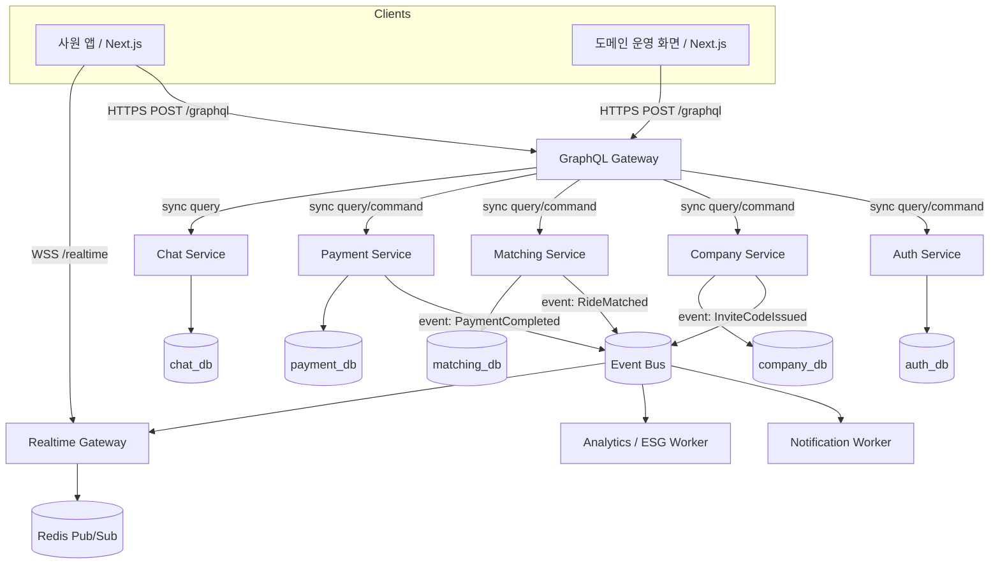

# Ridy — MSA 백엔드 아키텍처

## 결론

Ridy의 외부 API 진입점은 **GraphQL Gateway**로 둔다.
단, 내부 서비스 간 통신까지 GraphQL로 통일하지 않는다.

- 클라이언트 → 백엔드: `POST /graphql` 단일 GraphQL Gateway
- Gateway → 내부 조회성 호출: gRPC 또는 내부 HTTP
- Gateway → 상태 변경 후속 처리: 이벤트 메시지
- 실시간 채팅: WebSocket Gateway 별도 운영
- 서비스별 데이터 저장소는 논리적으로 분리하고, 다른 서비스 DB를 직접 조회하지 않는다

이 구조가 맞는 이유는 Ridy 클라이언트가 사원 앱과 도메인 운영 화면으로 나뉘고, 한 화면에서 인증/회사/매칭/정산 데이터를 조합해야 하기 때문이다. GraphQL은 **클라이언트용 API 조합 계층**에 적합하고, 내부 서비스 간 경계에는 명시적인 command/event 계약이 더 적합하다.

---

## 목표 구조



> MVP 단계에서는 단일 NestJS 애플리케이션 안에 위 bounded context를 모듈로 구현해도 된다. 다만 모듈 경계, GraphQL schema, 이벤트 이름, DB 소유권은 위 MSA 구조를 기준으로 설계한다.

---

## Gateway 역할

### GraphQL Gateway가 담당하는 것

| 책임 | 설명 |
|---|---|
| API 계약 | 클라이언트가 사용하는 단일 GraphQL schema 제공 |
| 인증 컨텍스트 | JWT 검증 후 `viewer`, `companyId`, `role`, `requestId`를 resolver context에 주입 |
| 회사 도메인 격리 | 모든 resolver에 `companyId` 스코프 강제. 가입 시 `Company.domain`과 회사 이메일/OAuth 이메일 도메인을 검증 |
| 데이터 조합 | 한 화면에 필요한 Auth/Company/Matching/Payment 데이터를 조합 |
| N+1 방지 | DataLoader, batch endpoint, resolver depth/complexity 제한 |
| 에러 표준화 | 내부 서비스 에러를 GraphQL `extensions.code`로 변환 |
| 관측성 | requestId/correlationId를 모든 내부 호출과 이벤트에 전파 |

### GraphQL Gateway가 하지 않는 것

| 금지 | 이유 |
|---|---|
| 서비스 DB 직접 조회 | 서비스 데이터 소유권이 깨짐 |
| 비즈니스 로직 보유 | Gateway가 비대해져 distributed monolith가 됨 |
| 장기 트랜잭션 처리 | 결제/매칭/알림은 이벤트와 saga로 처리해야 함 |
| 내부 서비스 간 GraphQL 강제 | schema coupling이 커지고 서비스 독립 배포가 어려워짐 |

---

## 서비스 경계

| 서비스 | Bounded Context | 주요 책임 | 소유 데이터 | 공개 계약 |
|---|---|---|---|---|
| GraphQL Gateway | API Composition | GraphQL schema, auth context, company scope, resolver orchestration | 없음 | `POST /graphql` |
| Auth Service | Identity & Access | 소셜 로그인, JWT, 세션, 권한 판단 | users, sessions, oauth_accounts | `AuthCommand`, `AuthQuery` |
| Company Service | Tenant & Admin | 회사, 가입 코드, 회사 이메일 도메인 검증, 구성원 목록, 후속 운영 통계 | companies, invite_codes, member_snapshots | `CompanyCommand`, `CompanyQuery`, events |
| Matching Service | Ride Matching | 카풀 등록/검색/요청/수락, 회사 도메인 내 매칭 | rides, ride_requests, vehicles, reviews | `MatchingCommand`, `MatchingQuery`, events |
| Chat Service | Conversation | 채팅방, 메시지 이력, 읽음 상태 | chat_rooms, messages, read_receipts | `ChatQuery`, WebSocket events |
| Payment Service | Settlement & Billing | 요금 계산, 정산, 토스페이먼츠 연동 | settlements, payments, payment_methods | `PaymentCommand`, `PaymentQuery`, events |
| Notification Worker | Notification | 푸시/이메일/SMS 발송 | notification_logs | event consumer |
| Analytics Worker | ESG & Metrics | 이용 통계, ESG 리포트 집계 | usage_stats, esg_reports | event consumer, `AnalyticsQuery` |

---

## 통신 규칙

### 동기 통신

동기 호출은 GraphQL Gateway가 화면 응답을 만들 때 필요한 짧은 조회/명령에만 사용한다.

| 호출 | 방식 | 기준 |
|---|---|---|
| Gateway → Auth | gRPC 또는 내부 HTTP | 토큰 검증, viewer 조회 |
| Gateway → Company | gRPC 또는 내부 HTTP | 회사/가입 코드/도메인 운영 데이터 조회 |
| Gateway → Matching | gRPC 또는 내부 HTTP | 라이드 조회, 매칭 요청 생성 |
| Gateway → Payment | gRPC 또는 내부 HTTP | 요금 미리 계산, 정산 조회 |
| Gateway → Chat | gRPC 또는 내부 HTTP | 채팅 이력 조회 |

### 비동기 이벤트

상태 변경 후속 작업은 이벤트로 처리한다.

| 이벤트 | 발행 서비스 | 구독 서비스 | 용도 |
|---|---|---|---|
| `UserJoinedCompany` | Auth | Company, Notification, Analytics | 사원 수 갱신, 가입 알림, 통계 |
| `InviteCodeIssued` | Company | Notification | 가입 코드 공유 알림 |
| `RideCreated` | Matching | Notification, Analytics | 신규 카풀 알림, 통계 |
| `RideRequested` | Matching | Notification | 운전자에게 요청 알림 |
| `RideMatched` | Matching | Chat, Payment, Notification, Analytics | 채팅방 생성, 예상 정산 생성, 알림, ESG 집계 |
| `RideCompleted` | Matching | Payment, Analytics | 정산 확정, 탄소 절감량 집계 |
| `PaymentCompleted` | Payment | Matching, Notification, Analytics | 정산 상태 반영, 알림, 매출 통계 |

이벤트에는 반드시 다음 메타데이터를 포함한다.

```json
{
  "eventId": "uuid",
  "eventType": "RideMatched",
  "occurredAt": "2026-06-11T00:00:00.000Z",
  "correlationId": "req_xxx",
  "companyId": "company_xxx",
  "actorId": "user_xxx",
  "payload": {}
}
```

---

## 데이터 소유권

| 데이터 | 소유 서비스 | 다른 서비스 접근 방식 |
|---|---|---|
| 사용자 인증/세션 | Auth | Auth query 또는 JWT claim |
| 회사/가입 코드/도메인 | Company | Company query, `UserJoinedCompany` 이벤트 |
| 라이드/매칭 요청 | Matching | Matching query, ride events |
| 채팅 메시지 | Chat | Chat query, WebSocket event |
| 결제/정산 | Payment | Payment query, payment events |
| ESG/이용 통계 | Analytics | Analytics query, events 기반 집계 |

규칙:

1. 서비스는 자신의 DB만 쓴다.
2. 다른 서비스 DB를 join하지 않는다.
3. 화면 조합은 GraphQL Gateway resolver에서 한다.
4. 통계/검색 최적화가 필요하면 이벤트 기반 read model을 별도로 둔다.
5. 회사 격리 키인 `companyId`는 모든 테이블과 이벤트에 포함한다.

---

## GraphQL Federation 여부

초기에는 **단일 GraphQL Gateway schema-first**로 간다.
Apollo Federation은 서비스가 실제로 독립 배포되고 schema ownership이 커진 뒤 도입한다.

| 단계 | 방식 | 이유 |
|---|---|---|
| MVP | 단일 Gateway schema + NestJS 모듈형 서비스 | 개발 속도, codegen 단순성 |
| 서비스 분리 1단계 | Gateway resolver가 내부 service client 호출 | 외부 schema 유지, 내부 배포 분리 |
| 서비스 분리 2단계 | 필요 시 Apollo Federation 검토 | 팀/서비스별 schema ownership 필요 시 |

현재 Ridy 규모에서는 Federation을 먼저 도입하면 복잡도만 커진다. GraphQL은 외부 API 계약으로 고정하고 내부 서비스 경계부터 깨끗하게 잡는 것이 우선이다.

---

## 운영 필수 기준

| 항목 | 기준 |
|---|---|
| 인증 | Gateway에서 JWT 검증, 내부 호출에는 signed internal token 또는 mTLS 적용 |
| 권한 | resolver 단위 `@auth`, `@adminOnly`, `@companyScope` 강제 |
| 타임아웃 | 모든 내부 호출에 1~3초 timeout |
| 재시도 | 읽기/멱등 명령만 제한적 retry, 결제 명령은 idempotency key 필수 |
| Circuit breaker | Gateway → 내부 서비스 호출별 적용 |
| Rate limit | IP/user/company 단위 제한 |
| Query complexity | depth, alias count, list limit 제한 |
| 관측성 | OpenTelemetry trace, structured log, correlationId 전파 |
| 헬스체크 | `/health/live`, `/health/ready` 제공 |

---

## 구현 지침

1. GraphQL SDL은 `backend/src/graphql/schema.graphql`을 SSoT로 둔다.
2. SDL은 도메인별 파일로 분리 가능하지만 build 시 하나의 schema로 합친다.
3. Resolver는 비즈니스 로직을 직접 갖지 않고 service client/usecase를 호출한다.
4. 모든 list field는 pagination input을 받는다.
5. 모든 mutation은 명시적인 payload type을 반환한다.
6. 결제/매칭처럼 후속 처리가 있는 mutation은 이벤트 발행까지 하나의 usecase로 묶는다.
7. 채팅 실시간 송수신은 WebSocket Gateway가 담당하고, GraphQL은 이력 조회/방 메타데이터 조회에 사용한다.
